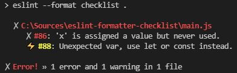
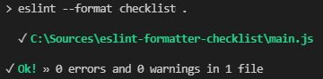

# eslint-formatter-checklist

[](https://www.npmjs.com/package/eslint-formatter-checklist)
[](https://github.com/jerone/eslint-formatter-checklist/actions/workflows/ci.yml)
[](https://github.com/jerone/eslint-formatter-checklist)
[](https://opensource.org/licenses/MIT)
[](https://github.com/prettier/prettier)

> An ESLint formatter with checklist style.

## Installation

```shell
npm install eslint-formatter-checklist --save-dev
```

## Usage

Run:

```shell
npx eslint --format checklist .
```

Or add script in your `package.json`:

```json
"scripts": {
  "lint": "eslint -f checklist ."
}
```

## Screenshot

Screenshot with error and warning:



Screenshot of success:


