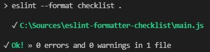

# eslint-formatter-checklist

> An ESLint formatter with checklist style.

## Installation

`npm install eslint-formatter-checklist --save-dev`

## Usage

Run:

```
node_modules\.bin\eslint --format checklist .
```

Or add script in your `package.json`:

```json
  "scripts": {
    "lint": "eslint -f checklist ."
  }
```

## Screenshot

Screenshot with error and warning:


Screenshot of success:


